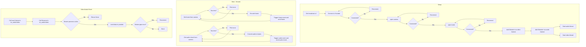

```mermaid
flowchart TD
subgraph "Setup"
    S_A[Get broadcast url] --> S_B[Connect to Youtube]
    S_B --> S_C{Connected?}
    S_C -- No --> S_D[Reconnect] --> S_B
    S_C -- Yes ---> S_E[open camera]
    S_E --> S_F{Connected?}
    S_F -- No --> S_G[Reconnect] --> S_E
    S_F -- Yes ---> S_H[open Audio]
    S_H --> S_I{Connected?}
    S_I -- No --> S_J[Reconnect] --> S_H
    S_I -- Yes ---> M_A[Add Streamer as video listener]
    M_A --> M_B[Add Streamer as audio listener]
    M_B --> AT1[Start audio thread]
    M_B --> VT1[Start video thread]
end
subgraph "Main - threads"
    VT2[Get frame from camera]
    VT2 --> VT3{Success?}
    VT3 -- No --> VT4[Print error] --> VT2
    VT3 -- Yes ---> VT5[Encode frame]
    VT5 --> VT6[Trigger frame event and send frame]
    VT6 --> VT2
    AT2[Get audio chunk from camera]
    AT2 --> AT3{Success?}
    AT3 -- No --> AT4[Print error] --> AT2
    AT3 -- Yes ---> AT5[Convert audio to bytes]
    AT5 --> AT6[Trigger audio event and send audio chunk]
    AT6 --> AT2
end

subgraph "Video/Audio Event"
    A[Call each listener's on_audio/video] --> B[Call Streamer's on_audio/video]
    B --> C{Stream process is alive}
    C -- No --> D[Return None]
    C -- Yes ---> E[send data to youtube]
    E --> F{Broken pipe error?}
    F -- Yes --> G[Reconnect]
    F -- No --> H[Done]
end
```